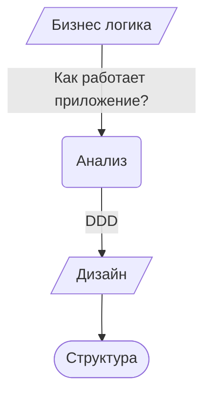

# Язык программирования Go
## Структура проекта в контексте предметно-ориентированного проектирования
### Анатолий Никифоров, МФТИ, 2023
#### Лекция 10

---

# ЧАВО

<v-clicks>

- Размещать все в пакете main?
- Начинать с одного пакета, а потом разбивать на другие пакеты?
- Как понять, что что-то должно быть в своем пакете?
- Просто использовать фреймворк?
- Какая парадигма программирования у Go?
- Микросервисы или монолит?
- Насколько пакеты должны быть взаимосвязаны?

</v-clicks>

<!-- 
- Не всегда мы знаем заранее сущности и структуру
- Структура часто меняется во время разработки
- Не всегда понятно, что выносить в пакет.
- Фреймворк ограничивает наши возможности. Дискуссии за и против.
- Частый вопрос новичков. Go необычный язык, там нет ООП в привычном понимании.
- Дискуссионный вопрос, чаще используются микросервисы, но они подходят не всегда.
- Должны ли они быть не взаимосвязаны, сильно  или слабо связанными?
-->

---
layout: quote
---

_«Так как Go будет языком, в который компании будут инвестировать в долгосрочной перспективе, сопровождение программ, написанных на Go, **легкость, с которой они могут быть изменены**, будет ключевым фактором их решений»._ – Dave Cheney, Golang UK 2016.

<!-- Почему важна структура? Без хорошей структуры сложно поддерживать приложение.  -->
---

# Хорошая структура

<v-clicks>

- Последовательность
- Легко понять, перемещаться, рассуждать. (имеет смысл)
- Легко менять, слабо-связанная
- Легко тестировать
- «Настолько простая, насколько возможно, но не проще»
- Дизайн точно отражает способ работы софта
- Структура точно отражает дизайн

</v-clicks>

<!-- 
- Писать код в одном стиле. Не реализовывать разные компоненты по разному. Нет ничего хуже, чем заниматься проектом, написанным разными людьми в разном стиле.
- Глядя на структуру, можно понять что делает приложение. Легко находить нужные части в структуре. Понятно что и где лежит. Осмысленная структура.
- Пакеты если связаны, то слабо, чтобы можно было их заменять.
- Понятно, как писать тест, для каждого компонента.
- Отсылка к Эйнштейну. Не упрощать ради упрощения.
- Дизайн не должен быть каким-то шаблоном, оторванным от анализа бизнес-логики. Можно использовать шаблоны, для типичной бизнес логики, но лучше анализировать бизнес-логику и строить дизайн от нее, т.е. от каждого конкретного случая.
- Структура является продолжением бизнес логики.
- Структура отражает работу приложения.
-->

---
layout: center
---



<!-- Парадигма может быть любой, процедурной, ООП, функциональной, но структура отражает дизайн. Это помогает построить понятную структуру, в котрой легко ориентироваться -->

---

# Demo

Сервис отзывов о пиве

- Пользователи могу добавлять пиво
- Пользователи могу добавлять обзор на пиво
- Пользователи могут получать список всего пива
- Пользователи могут получать список всех обзоров на заданное пиво
- Выбор хранения данных в памяти или в JSON файле
- Возможность добавлять образцы данных

---
layout: section
---

# Плоская структура

---

# Плоская структура

```text
.
├── data.go
├── handlers.go
├── main.go
├── model.go
├── storage.go
├── storage_json.go
└── storage_mem.go
```

<!--
Структура:
- data.go – образцы данных
- handlers.go – API
- main.go – запуск приложения
- model.go – структуры пива и обзора
- storage.go – операции взаимодействия с хранилищем
- storage_json.go, storage_mem.go – реализации хранилищ
Достоинства:
- Простая и понятная структура
- Если не знаешь с чего начать, начни с плоской структуры
- Для маленьких библиотек проектов от 10 до 20 бизнес операций
- Нет циклических зависимостей
Недостатки:
- все в глобальном состоянии
- нет возможности убрать что-то в черный ящик
- все доступно всему
- Говорит ли структура о том, что делает приложение?
- Названия файлов не говорят ни о чем, надо открывать их и смотреть код и делать выводы.

Можно ли разбить на маленькие пакеты?
-->

---
layout: section
---

# Группировка по функциям 

---

## Группировка по функциям («слоенная архитектура»)

- представление/пользовательский интерфейс
- бизнес логика
- внешние зависимости/инфраструктура

<!--
Этот способ известен как слоенная архитектура. Представьте, что у вашего приложения несколько слоев: пользовательский интерфейс или слой представлений, бизнес логика и внешние зависимости: API, БД, инфраструктура. Мы можем сгруппировать наш код, на основании слоя, к которому он принадлежит: контроллеры, представления, DAO, интерфейс знакомы всем. Кажется, это названия из классического MVC. Это очень популярный шаблон, используемый во многих фреймворках и приложениях.
-->

---

## Группировка по функциям

```text{3,7,11}
.
├── data.go
├── handlers
│   ├── beers.go
│   └── reviews.go
├── main.go
├── models
│   ├── beer.go
│   ├── review.go
│   └── storage.go
└── storage
    ├── json.go
    └── memory.go
```

<!--
У нас есть обработчики, модели и хранилище.

Достоинства:
- Легко решить, куда что идет, какой код где должен находится
- Лишает возможности использовать глобальное состояние и побуждает размещать код в соответствующих пакетах

Недостатки:
- Если есть переменная, разделенная между слоями, в какой слой ее положить? Или объявить во всех слоях?
- Где все инициализируется? main инициализирует хранилище и передает его в каждую модель или каждая модель инициализирует свое собственное хранилище?
- У нас одна модель для пива или две разных модели для экземпляра и списка?
- Если у нас одно определение структуры beer, значит все слои разделяют это определение. Это лишает нас возможности применять разный контекст к структуре. Пример: когда я добавляю пиво, я использую структуру beer, у которой есть ID, и при добавлении пива, я ожидаю, что мне не нужно указывать ID, приложение должно само с этим справиться. Но у структуры есть ID, и, как пользователь, я не понимаю, указывать мне ID или нет. Но когда я хочу получить список пива, я ожидаю получить их с ID, и здесь нам нужен ID в структуре. Код не указывает нам как программистам какие поля мы должны использовать, мы должны справляться с этим сами.
- Самый большой недостаток: эта структура не компилируется. Причина тому – цикличные зависимости между пакетом storage, который использует пакет models для определения пива, и пакетом models, который использует пакет storage для вызова БД.
- Файлы могут становится большими, а приложение трудно поддерживаемым.
- Как и плоская структура, эта структура не говорит о том, что делает приложение.

-->

---
layout: section
---

# Группировка по модулям

---

# Группировка по модулям

```text{2,6,9}
.
├── beers
│   ├── beer.go
│   └── handler.go
├── main.go
├── reviews
│   ├── handler.go
│   └── review.go
└── storage
    ├── data.go
    ├── json.go
    ├── memory.go
    └── storage.go
```

<!-- 
Идея: все, что связано с пивом, идет в один пакет, все, что связано с обзорами в другой и все, что связано с хранилищем, в третий.

Единственное достоинство – логическая группировка.

Недостатки:
- Сложно решить, положить reviews в пакет beer, так как это BeerReview, или ему нужен свой пакет?
- Именование хуже потому, что теперь beers.beer.go – тавтология.
- (Открыть пакет modular) Плохое название: storage.JSONStorage, хочу storage.JSON, но JSON уже определен в storage.go. В итоге компромисс: storage.JSONStorage.
-->

---


# Группировка по контексту
Предметно-ориентированное проектирование

<div class="flex">
    <div class="container flex-col">
        
        <p class="text-xs">Первая работа, доступна в переводе.</p>
    </div>
    <div class="container flex-col">
        
    </div>
    <div class="container flex-col">
        
    </div>
    <div class="container flex-col">
        
    </div>
</div>

Список не полный

<!--
Не парадигма программирования, не методология разработки ПО, набор правил и понятий для организации архитектуры. Написана Эриком Эвансом в 2003, популяризирована разработчиком Вон Верноном. DDD не говорит куда какие файлы ложить, но помогает организовать структуру.
-->

---

# Предметно-ориентированное проектирование

<v-clicks>

- Установить свою _область_ (domain) и бизнес логику
- Определить _ограниченные контексты_ (bounded contexts), модели в каждом контексте и _язык описания_.
- Разбить по категориям строительные блоки своей системы:
    - Сущность
    - Объект-значение
    - Событие
    - Агрегат
    - Служба
    - Репозиторий
    - Фабрика

</v-clicks>

<!-- 
- Область – предметная область, бизнес логика приложения. Область состоит из поддоменов.
- Ограниченные контексты – логические части области, в которых определяются модели. Контексты ограничивают модели. Пользователь имеет разный вид в разных контекстах. Контексты помогают нам менять существующие модели, не затрагивая другие контексты.
-->

---

**Область**: дегустация пива

**Язык**: пиво, обзор, хранилище, ...

**Сущности**: Beer, Review

**Объекты-значения**: Пивоварня(Brewery), Автор, ...

**Агрегаты**: BeerReview

**Службы**: Beer adder / adding, Review adder, Beer lister / listing, Review lister

**Cобытия**: Beer added, Review added, Beer already exist, Beer not found, ...

**Репозитории**: Beer repository, Review repository

<!-- 
- Один контекст: дегустация пива
- Язык понимают все участники разработки. Другие люди понимают о чем вы говорите, чтобы вносить поправки.
Сущности и объекты-значения, в чем разница?
- Сущности – это абстракции, которые имеют конкретные экземпляры.
- Объекты-значения являются частью сущностей, но не являются сущностями. Похоже на поля структур или свойства классов.
- Агрегаты комбинируют сущности: допустимы мета сущности, определяющие отношения других сущностей.
- Cлужбы: stateless операции над сущностью, которые не могут выходить за рамки ее логики. Сущность не может самостоятельно производить эти операции.
- События захватывают что-то в вашей системе, что меняет состояние приложения (ошибки, уведомления и т.п.)
- Репозитории – это фасад для хранилища, то, что находится между бизнес логикой и хранилищем (БД).

Это не строгий дизайн, необязательно должно быть так, необязательно включать все понятий в свой дизайн. Все зависит от бизнес логики.
-->

---

```text{2,5,8,12,15}
.
├── adding
│   ├── endpoint.go
│   └── service.go
├── beers
│   ├── beer.go
│   └── sample_beers.go
├── listing
│   ├── endpoint.go
│   └── service.go
├── main.go
├── reviewing
│   ├── endpoint.go
│   └── service.go
├── reviews
│   ├── review.go
│   └── sample_reviews.go
└── storage
    ├── json.go
    ├── memory.go
    └── type.go
```

<!--
adding, listing, reviewing – это службы.
Достоинства:
- Теперь названия пакетов говорят нам о то, что они делают.
- Избегаем цикличных зависимостей потому, что теперь службы обращаются к хранилищу, а хранилище обращается к beers и reviews. К тому же, пакетам моделей beers и reviews нет дела до хранилища.

Недостатки:
- Куда положить образцы данных и их добавление?
- Что если мне нужен другой фронтенд? Например, я хочу добавлять из СLI, вместо запросов по HTTP. Куда и что положить в этой структуре?
-->

---

# Гексагональная (шестиугольная) архитектура
«Порты и адаптеры»

<div class="px-48">
    <iframe class="speakerdeck-iframe" frameborder="0" src="https://speakerdeck.com/player/de8629f0bf520131c2e20239d959ba18?slide=12" title="Hexagonal Architecture" allowfullscreen="false" style="border: 0px; background: padding-box padding-box rgba(0, 0, 0, 0.1); margin: 0px; padding: 0px; border-radius: 6px; box-shadow: rgba(0, 0, 0, 0.2) 0px 5px 40px; width: 100%; height: auto; aspect-ratio: 560 / 420;" data-ratio="1.3333333333333333"></iframe>
</div>
<!-- 
Главное разделять бизнес-логику (Core domain) от внешних зависимостей. Внешние зависимости – это все, с чем взаимодействует приложение. Проблема, которую решает Гексагональная архитектура – заменяемость одного из компонентов, без влияния на другие компоненты или на всю бизнес логику. Пример: если я захочу поменять БД, то бизнес логике все равно, какая используется БД, она останется неизменной. Как это возможно?
-->

---

# Гексагональная архитектура

<div class="px-48">
    <iframe class="speakerdeck-iframe" frameborder="0" src="https://speakerdeck.com/player/de8629f0bf520131c2e20239d959ba18?slide=22" title="Hexagonal Architecture" allowfullscreen="true" style="border: 0px; background: padding-box padding-box rgba(0, 0, 0, 0.1); margin: 0px; padding: 0px; border-radius: 6px; box-shadow: rgba(0, 0, 0, 0.2) 0px 5px 40px; width: 100%; height: auto; aspect-ratio: 560 / 420;" data-ratio="1.3333333333333333"></iframe>
</div>

<!--
Внешние слои могут ссылаться на то, что определено в домене, но домен не ссылается на внешние слои, поэтому изменения во внешних слоях (интерфейсах) не влечет изменения в домене. Для этого используются интерфейсы и инверсию управления. Интерфейсы лежат на любой границе каждого слоя. Сore domain определяет бизнес логику в абстрактных терминах без деталей реализации, а все остальные слои приложения определяют эти интерфейсы чтобы удовлетворить требованиям безнес логики. Внутренние слои тоже определяют свои интерфейсы, например, слой Application мог бы определять интерфейс storage потому что ему нужно хранилище чтобы функционировать. Тогда внешние слои должны будут удовлетворять этому и имплементировать этот интерфейс конкретным типом хранилища. Это значит, что да тех пор, пока требования интерфейса какого-то слоя удовлетворены, мы можем легко менять конкретные реализации, например, реализации БД.
-->

---
layout: two-cols
---

```text{11,18|3,5,15}
.
├── cmd
│   ├── beer-server
│   │   └── main.go
│   └── sample-data
│       ├── main.go
│       ├── sample-data
│       ├── sample_beers.go
│       └── sample_reviews.go
└── pkg
    ├── adding
    │   ├── beer.go
    │   ├── service.go
    │   └── service_test.go
    ├── http
    │   └── rest
    │       └── handler.go
    ├── listing
    │   ├── beer.go
    │   ├── review.go
    │   └── service.go
```

::right::

```text{1|4}
    ├── reviewing
    │   ├── review.go
    │   └── service.go
    └── storage
        ├── idgen.go
        ├── idgen_test.go
        ├── json
        │   ├── beer.go
        │   ├── repository.go
        │   └── review.go
        └── memory
            ├── beer.go
            ├── repository.go
            └── review.go
```

<!-- adding, listing, reviewing – службы и пакеты, которые принадлежать слою Domain. Можно собрать их в директорию domain. Но лучше придерживаться плоскости, чтобы не увеличивать дерево. Также мы переместили определения структур в каждый из доменных пакетов. Теперь в adding.beer.Beer нету ID, а в listing.beer.Beer он есть. Пакеты beer-server, sample-data, http, storage – интерфейсы. cmd и pkg необязательны, но они разделяют бинарники от кода. В cmd два main файла: один для запуска чистого сервера, другой для запуска сервера с образцами данных. Файлы инфраструктуры, Dockerfile, конфиги и т.д идут в pkg. 

Как добавить CLI? сделать директорию в cmd.

Структура показывает что делает приложение (adding, listing, reviewing).
 -->

---
layout: two-cols
---

```text{15-20}
.
├── cmd
│   ├── beer-server
│   │   └── main.go
│   └── sample-data
│       ├── main.go
│       ├── sample-data
│       ├── sample_beers.go
│       └── sample_reviews.go
└── pkg
    ├── adding
    │   ├── beer.go
    │   ├── service.go
    │   └── service_test.go
    ├── http
    │   └── rest
    │   |   └── handler.go
    │   ├── rpc
    │   ├── soap
    │   └── ...
    ├── listing
    │   ├── beer.go
    │   ├── review.go
    │   └── service.go
```

::right::

```text{0}

    ├── reviewing
    │   ├── review.go
    │   └── service.go
    └── storage
        ├── idgen.go
        ├── idgen_test.go
        ├── json
        │   ├── beer.go
        │   ├── repository.go
        │   └── review.go
        └── memory
            ├── beer.go
            ├── repository.go
            └── review.go
```

<!-- 
Легко добавлять новые вещи. rpc, soap и rest используют одни и те же модели (бизнес логику).
-->

---
layout: center
---

<iframe src="https://giphy.com/embed/glvyCVWYJ21fq" width="480" height="284" frameBorder="0" class="giphy-embed" allowFullScreen></iframe><p><a href="https://giphy.com/gifs/song-windshield-wipers-glvyCVWYJ21fq">via GIPHY</a></p>

<!--
- Эта структура решает много проблем, но является излишней для простых проектов. Не усложняй, если не нужно.
- Необязательно начинать с директорий pkg и cmd, их можно добавить позже, если нужно.
- Начинайте с простой плоской структуры. Вы всегда можете перейти к этой структуре позже. Начинайте сразу с этой структуры только если вы знаете, что делаете сложное приложение.
- DDD можно применять и в плоской структуре. DDD не диктует конкретную структуру. Группируйте свой код по контекстам в доменах, а не по функциональности и конкретным реализациям. Тогда это может играть в вашу пользу.
-->

---

# Фреймворки?

## Bufallo, Martini, Gin...
- [https://www.cronj.com/blog/best-golang-web-frameworks/](https://www.cronj.com/blog/best-golang-web-frameworks/)

## Шаблон для реализации собственной структуры
- [https://github.com/thockin/go-build-template](https://github.com/thockin/go-build-template)

## Hashtag on GitHub

- [https://github.com/topics/hexagonal-architecture](https://github.com/topics/hexagonal-architecture)

<!--
1. Существует ли фреймворк, который реализует все это? И да, и нет. Разные фреймворки используют разные подходы. 
Использовать фреймворк? Да, если он подходит под вашу бизнес логику. Фреймворк позволяет быстро начать и освобождает от необходимости писать кучу шаблонного кода. Помните, что фреймворк приносит свою собственную сложность в проект. Лучше начинать структуру с нуля, чтобы на своем опыте освоить различные методы организации структуры, и в дальнейшем распознавать их в разных фреймворках. Это позволит судит о фреймворках.

2. Шаблон предопределяет Dockerfile и Makefile для ваших приложений, и там есть пустые cmd и pkg, так что он оставляет конкретную реализацию структура для вас. Он позволяет вам быстрее развернуть структуру проекта.
-->

---

# Тестирование

- Храните _test.go рядом с main
- Используйте общедоступные mock пакеты (reusable)

---

# Именование

- Имена пакетов должны отражать то, что мы ожидаем увидеть внутри.
    - Сообщают свою роль, для чего нужны, а не то, что они содержат.
- Избегайте обобщенных имен типа utils, common и т.д.
- Придерживайтесь обычных соглашений в Go ([https://go.dev/talks/2014/names.slide#1](https://go.dev/talks/2014/names.slide#1))
- Избегайте тавтологий (string.Reader, а не strings.StringReader).


<!--
2. Такие пакеты обычно становятся мусоркой для всего, что не вписывается в другие пакеты., которая становится только больше со временем.
-->

---

# Выводы

<v-clicks>

- Две высокоуровневые директории: cmd (для ваших бинарников) и pkg (для ваших пакетов).
- Группируйте по контексту, а не по обобщенной функциональности.
- Зависимости в своих пакетах.
- Моки – общедоступные пакеты.
- Другие файлы проекта (fixtures, docs, Docker, ... ) в корне вашего проекта.
- Пакет main объединяет и запускает все.
- Избегайте глобальной области и init() видимости для лучшей поддержки приложения

</v-clicks>

<!--
2. Если у вас множество пакетов, вероятно лучше использовать DDD (думать о доменах, а не функциональной реализации).
7. init вносит скрытое поведение.
-->

---

# Заключение

<v-clicks>

- Не существует единственно правильной структуры
- Будьте гибкими (Agile)
- «Настолько простая, насколько возможно, но не проще»
- Будьте последовательны
- Экспериментируйте!

</v-clicks>

<!--
Читайте stdlib, cmd и pkg были не всегда, они появились из личного опыта сообщества.
-->

---
layout: center
---

# Credits

<Youtube id="oL6JBUk6tj0" width="800" height="400" />

---

# Ссылки

- Demo: [https://github.com/katzien/go-structure-examples](https://github.com/katzien/go-structure-examples)
- Википедия: [Предметно-ориентированное проектирование](https://ru.wikipedia.org/wiki/%D0%9F%D1%80%D0%B5%D0%B4%D0%BC%D0%B5%D1%82%D0%BD%D0%BE-%D0%BE%D1%80%D0%B8%D0%B5%D0%BD%D1%82%D0%B8%D1%80%D0%BE%D0%B2%D0%B0%D0%BD%D0%BD%D0%BE%D0%B5_%D0%BF%D1%80%D0%BE%D0%B5%D0%BA%D1%82%D0%B8%D1%80%D0%BE%D0%B2%D0%B0%D0%BD%D0%B8%D0%B5)
- Хабр: [Гексагональная архитектура](https://habr.com/ru/articles/267125/)

---
layout: end
---